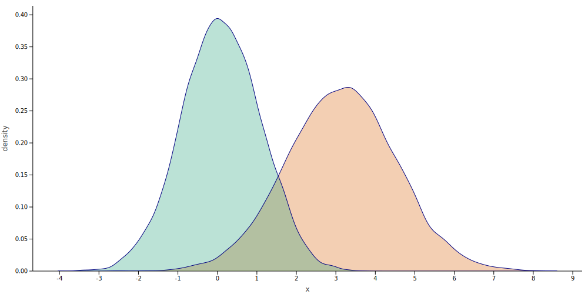
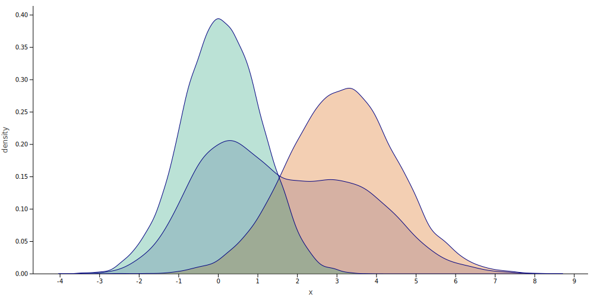
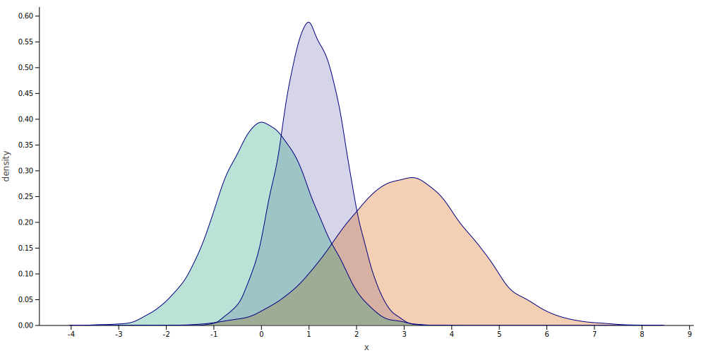

# Markovian

Symbolic integration and probabilistic programming in the spirit of [Church](https://web.stanford.edu/~ngoodman/papers/churchUAI08_rev2.pdf) and [Anglican](https://probprog.github.io/anglican/index.html).

## Research Questions

* Is there a way to compile PGMs to [probabilistic circuits](https://web.cs.ucla.edu/~guyvdb/slides/TPMTutorialUAI19.pdf#1)?
* Is there a algebra that unifies belief prop on PGMs/PCs and backprop on computation graphs?
* Is there a family of functions which is closed over differentiation and integration?
* Is there a tractable inversion sampling procedure for higher dimensional quantiles?
* Is there a way to perform inference on Bayesian networks [using backprop](https://arxiv.org/pdf/1301.3847.pdf)?
* Is there a [formula](https://en.wikipedia.org/wiki/Propagation_of_uncertainty#Example_formulae) for propagating uncertainty through elementary functions?

## Example

Suppose we have two Gaussian distributions with known parameters and want to combine them somehow:

How could we combine them to form a new distribution? We could simply average their densities:

But this might not be a valid operation depending on the units. We could "mix" them by flipping a coin:

But the mean of the mixture might not give the mean of the two datasets. Or we could multiply the PDFs:

Two Gaussian distributions, when multiplied together form another Gaussian! This is a very nice property.

Now we do not need to sample from the parents, but can discard them and sample directly from the child!

## Combinatorial Properties

* [Stable distributions](https://en.wikipedia.org/wiki/Stable_distribution) are closed under convolution and linear combination of their random variables.
* A distribution is called [infinitely divisible](https://en.wikipedia.org/wiki/Infinite_divisibility_(probability)) if it can be expressed as the sum of an arbitrary number of IID RVs.
* Gaussian distributions form a [monoid](https://izbicki.me/blog/gausian-distributions-are-monoids).

We can use these algebraic properties to signficantly simplify certain mixture distributions.

See [notebook](notebooks/combinator_exploration.ipynb) for further implementation details.

# References

## Symbolic Methods

* [Symbolic Exact Inference for Discrete Probabilistic Programs](https://arxiv.org/pdf/1904.02079.pdf), Holtzen et al. (2019)
* [APPL: A Probability Programming Language](https://www.tandfonline.com/doi/pdf/10.1198/000313001750358509), Glen et al. (2012)
* [Symbolic Statistics with SymPy](http://people.cs.uchicago.edu/~mrocklin/tempspace/sympystats.pdf), Rocklin (2010)
* [PSI: Exact Symbolic Inference for Probabilistic Programs](https://files.sri.inf.ethz.ch/website/papers/psi-solver.pdf), Gehr et al. (2016)
* [λPSI: Exact Inference for Higher-Order Probabilistic Programs](https://files.sri.inf.ethz.ch/website/papers/pldi20-lpsi.pdf), Gehr et al. (2020)
* [Symbolic Maximum Likelihood Estimation with Mathematica](https://rss.onlinelibrary.wiley.com/doi/pdf/10.1111/1467-9884.00233), Rose and Smith (2001)
* [The Harmonic Logarithms and the Binomial Formula](https://core.ac.uk/download/pdf/82415331.pdf), Roman (1993)
* [Closed Form Integration of Artificial Neural Networks](https://escholarship.org/content/qt0wz7n7nm/qt0wz7n7nm.pdf#page=5), Gottschling (1999)
* [A New Method for Efficient Symbolic Propagation in Discrete Bayesian Networks](https://doi.org/10.1002/(SICI)1097-0037(199608)28:1%3C31::AID-NET5%3E3.0.CO;2-E), Castillo and Gutierrez (1996)
* [A New Distribution on the Simplex with Auto-Encoding Applications](https://papers.nips.cc/paper/9520-a-new-distribution-on-the-simplex-with-auto-encoding-applications.pdf), Stirn et al. (2019)
* [Theano: A Python framework for fast computation of mathematical expressions](https://arxiv.org/pdf/1605.02688.pdf#section*.12), Al-Rfou et al. (2016)

## Algebraic Methods

* [The Generalized Distributive Law](https://authors.library.caltech.edu/1541/1/AJIieeetit00.pdf), Aji and McEliece (2000)
* [A Logical Approach for Factoring Belief Networks](http://reasoning.cs.ucla.edu/fetch.php?id=24&type=pdf), Darwiche (2002)
* [Algebra of inference in graphical models revisited](https://www.researchgate.net/profile/Russ_Greiner/publication/266262013_Algebra_of_inference_in_graphical_models_revisited/links/543bb0350cf204cab1db12fa/Algebra-of-inference-in-graphical-models-revisited.pdf), Ravanbakhsh and Greiner (2014)
* [Boolean Matrix Factorization and Noisy Completion via Message Passing](http://proceedings.mlr.press/v48/ravanbakhsha16-supp.pdf), Ravanbakhsh et al. (2016)
* [Message Passing and Combinatorial Optimization](https://arxiv.org/pdf/1508.05013.pdf), Ravanbakhsh (2015)
* [Bayesian Boolean Matrix Factorisation](https://arxiv.org/pdf/1702.06166.pdf), Rukat et al. (2017)
* [Methods and Applications of (max,+) Linear Algebra](https://hal.inria.fr/inria-00073603/document), Gaubert (2006)
* [A New Algebra for the Treatment of Markov Models](http://asrl.utias.utoronto.ca/~tdb/bib/barfoot_tr03a.pdf), Barfoot and D'Eleuterio (2003)

## Uncertainty Propagation

* [A computational system for uncertainty propagation of measurement results](https://doi.org/10.1016/j.measurement.2009.01.011), Mari (2009)
* [Notes on the Use of Propagation of Error Formulas](https://nvlpubs.nist.gov/nistpubs/jres/70C/jresv70Cn4p263_A1b.pdf), Ku (1966)
* [Calculating measurement uncertainty using automatic differentiation](https://doi.org/10.1088/0957-0233/13/4/301), Hall (2001)
* [Propagating Uncertainty in Instrumentation Systems](https://doi.org/10.1109/TIM.2005.859142), Hall (2005)
* [Object-oriented software for evaluating measurement uncertainty](https://doi.org/10.1088%2F0957-0233%2F24%2F5%2F055004), Hall (2013)
* [Propagation of uncertainty: Expressions of second and third order uncertainty with third and fourth moments](https://doi.org/10.1016/j.measurement.2007.07.004), Mekid and Vaja (2008)
* [Propagation of errors for matrix inversion](https://doi.org/10.1016/S0168-9002(00)00323-5), Lefebvre (2000)
* [An algebraic model for the propagation of errors in matrix calculus](https://arxiv.org/pdf/1907.12948.pdf), Tran (2019)
* [Error propagation in Runge-Kutta methods](https://doi.org/10.1016/S0168-9274(96)00040-2), Spijker (1996)
* [Error propagation and algorithms](https://arxiv.org/pdf/1805.11813.pdf#subsection.2.1), Clift and Murfet (2019)
* [Propagating Covariance in Computer Vision](http://www.haralick.org/conferences/Propagating_Covariance.pdf), Haralick (1994)
* [Propagation of Probabilities, Means, and Variances in Mixed Graphical Association Models](https://doi.org/10.1080/01621459.1992.10476265), Lauritzen (1992)
* [Uncertainty Propagation in Data Processing Systems](https://doi.org/10.1145/3267809.3267833), Manousakis et al. (2018)

### Tutorials

* [Propagation of Uncertainty through Mathematical Operations](http://web.mit.edu/fluids-modules/www/exper_techniques/2.Propagation_of_Uncertaint.pdf)
* [A Summary of Error Propagation](http://ipl.physics.harvard.edu/wp-uploads/2013/03/PS3_Error_Propagation_sp13.pdf)
* [An Introduction To Error Propagation](https://infoscience.epfl.ch/record/97374/files/TR-98-01R3.pdf), Arras (1998)

## Fast Sampling/Inference

* [A Differential Approach to Inference in Bayesian Networks](https://arxiv.org/pdf/1301.3847.pdf), Darwiche (2000)
* [Scaling Exact Inference for Discrete Probabilistic Programs](https://arxiv.org/pdf/2005.09089.pdf), Holtzen et al. (2020)
* [Parallel Weighted Model Counting with Tensor Networks](https://arxiv.org/pdf/2006.15512.pdf), Dudek and Vardi (2020)
* [Affine Algebraic Decision Diagrams (AADDs) and their Application to Structured Probabilistic Inference](http://users.cecs.anu.edu.au/~ssanner/Papers/aadd.pdf), Sanner and McAllester (2005)
* [Faster Algorithms for Max-Product Message-Passing](https://cseweb.ucsd.edu/~jmcauley/pdfs/jmlr11.pdf), McAuley and Caetano (2011)
* [Approximate Inference by Compilation to Arithmetic Circuits](http://ai.cs.washington.edu/www/media/papers/nips10b.pdf), Lowd and Domingos (2010)
* [Fast inverse transform sampling in one and two dimensions](https://arxiv.org/pdf/1307.1223.pdf), Olver and Townsend (2013)
* [Fast and accurate parallel quantile computation](https://discovery.ucl.ac.uk/id/eprint/1482128/1/Luu_thesis.pdf#page=12), Luu (2016)
* [Fast Random Integer Generation in an Interval](https://arxiv.org/pdf/1805.10941.pdf), Lemire (2018)
* [Fast Evaluation of Transcendental Functions](https://www.researchgate.net/profile/Ekaterina_Karatsuba/publication/246166981_Fast_evaluation_of_transcendental_functions/links/0deec528ab5b45f8bc000000/Fast-evaluation-of-transcendental-functions.pdf), Karatsuba (1991)

### Probabilistic Circuits (e.g. ACs, SPNs, PSDDs, et al.)

* [Probabilistic Circuits: Representations, Inference, Learning and Theory](https://web.cs.ucla.edu/~guyvdb/slides/TPMTutorialUAI19.pdf), Vergari et al. (2020) [[ECML-PKDD talk](https://www.youtube.com/watch?v=2RAG5-L9R70)]
* [Sum-product networks: A survey](https://arxiv.org/pdf/2004.01167.pdf), París et al. (2020)
* [Sum-Product Networks: A New Deep Architecture](http://spn.cs.washington.edu/spn/poon11.pdf), Poon and Domingos (2012) [[source code](http://spn.cs.washington.edu/spn/downloadspn.php), [user guide](http://spn.cs.washington.edu/spn/spn-user-guide.pdf)]
* [Learning the Structure of Sum-Product Networks](https://homes.cs.washington.edu/~pedrod/papers/mlc13.pdf) Gens and Domingos (2013) [[source code](http://spn.cs.washington.edu/learnspn/)]
* [Tractable Operations for Arithmetic Circuits of Probabilistic Models](https://papers.nips.cc/paper/6363-tractable-operations-for-arithmetic-circuits-of-probabilistic-models.pdf), Shen, Choi and Darwiche (2016)
* [On Relaxing Determinism in Arithmetic Circuits](https://arxiv.org/pdf/1708.06846.pdf), Choi and Darwiche (2017)
* [The Sum-Product Theorem: A Foundation for Learning Tractable Models](https://homes.cs.washington.edu/~pedrod/papers/mlc16.pdf), Friesen (2016)
* [The Sum-Product Theorem and its Applications](https://digital.lib.washington.edu/researchworks/bitstream/handle/1773/40872/Friesen_washington_0250E_18101.pdf), Friesen (2016)
* [Learning and Inference in Tractable Probabilistic Knowledge Bases](https://homes.cs.washington.edu/~pedrod/papers/uai15.pdf), Niepert and Domingos (2015)
* [Combining Sum-Product Network and Noisy-Or Model for Ontology Matching](http://disi.unitn.it/~pavel/om2015/papers/om2015_TSpaper1.pdf), Li (2015)
* [On the Relationship between Sum-Product Networks and Bayesian Networks](https://arxiv.org/pdf/1501.01239.pdf) Zhao et al. (2015) [[slides](https://pdfs.semanticscholar.org/e6ae/d5eb4d3330ed0024063dc64226517bc41fb7.pdf)]
* [Two Reformulation Approaches to Maximum-A-Posteriori Inference in Sum-Product Networks](https://www.alessandroantonucci.me/papers/maua2020a.pdf), Maua et al. (2020)
* [Sum-Product Graphical Models](https://ipa.iwr.uni-heidelberg.de/dokuwiki/Papers/Desana2020aa.pdf), Desana and Schnörr (2020)

## Software

* [SPFlow: An easy and extensible library for deep probabilistic learning using sum-product networks](https://arxiv.org/pdf/1901.03704.pdf), Molina et al. (2019) [[source code](https://github.com/SPFlow/SPFlow)]
* [CREMA: A Java Library for Credal Network Inference](https://pgm2020.cs.aau.dk/wp-content/uploads/2020/09/huber20.pdf), Huber et al. (2020) [[source code](https://github.com/IDSIA/crema)]
* [CREDICI: A Java Library for Causal Inference by Credal Networks](https://pgm2020.cs.aau.dk/wp-content/uploads/2020/09/cabanas20a.pdf), Cabañas et al. (2020) [[source code](https://github.com/IDSIA/credici)]
* [JavaBayes: Bayesian networks in Java](https://people.montefiore.uliege.be/lwh/javabayes/javabayes-manual-0.346.pdf), Cozman (2001) [[source code](https://github.com/joeschweitzer/javabayes)]
* [Dimple: Java and Matlab libraries for probabilistic inference](https://s3.amazonaws.com/files.dimple.probprog.org/DimpleUserManual_v0.07_Java_API.pdf) [[source code](https://github.com/analog-garage/dimple)]
* [Theano-PyMC](https://pymc-devs.medium.com/the-future-of-pymc3-or-theano-is-dead-long-live-theano-d8005f8a0e9b), Willard (2020) [[source code](https://github.com/pymc-devs/Theano-PyMC)]
* [MonteCarloMeasurements.jl: Nonlinear Propagation of Arbitrary MultivariateDistributions by means of Method Overloading](https://arxiv.org/pdf/2001.07625.pdf), Carlson (2020) [[source code](https://github.com/baggepinnen/MonteCarloMeasurements.jl)]
